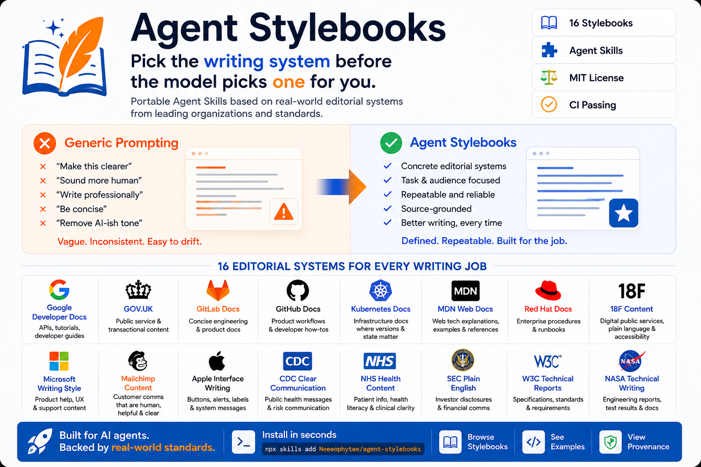

# Agent Stylebooks

> Pick the writing system before the model picks one for you.



Stop asking AI to “write better.” Give it an editorial system.

Portable [Agent Skills](https://agentskills.io/) based on established editorial systems.

[](CATALOG.md)
[](https://agentskills.io/)
[](LICENSE)
[](https://github.com/Neeeophytee/agent-stylebooks/actions/workflows/validate.yml)

<a href="https://webafterai.substack.com/"></a>

```sh
npx skills add Neeeophytee/agent-stylebooks
```

[Browse stylebooks](CATALOG.md) · [Installation](INSTALL.md) · [Examples](EXAMPLES.md) · [Provenance](PROVENANCE.md)

Each stylebook defines what to lead with, how to order information, which distinctions
must survive editing, what ambiguity is unacceptable, and how to check the result. These
are community-maintained Agent Skills derived from publicly documented editorial guidance,
not official vendor or agency products.

## Which stylebook should I use?

Choose by the reader's task and the artifact—not by the organization named in the draft.

| Recommended stylebook | I am writing... |
| --- | --- |
| `$google-developer-docs` | API or setup tutorial, how-to guide, onboarding instructions |
| `$govuk` | Public-service eligibility page, decision guide, application instructions |
| `$gitlab-docs` | Engineering or product docs, internal documentation, feature guide |
| `$github-docs` | Product workflow, step-by-step guide, troubleshooting article |
| `$mdn-web-docs` | Web API explanation, technical reference, learning article |
| `$kubernetes-docs` | Infrastructure procedure, operations runbook, deployment guide |
| `$nhs-health-content` | Health or patient content, explainer, care instructions |
| `$cdc-clear-communication` | Public-health message, safety advisory, awareness campaign |
| `$sec-plain-english` | Investor disclosure, business report, risk explanation |
| `$w3c-technical-reports` | Technical specification, standards document, requirements definition |
| `$nasa-technical-writing` | Engineering or test report, research report, findings summary |
| `$microsoft-writing-style` | Product help or UX copy, support article, interface guidance |
| `$apple-interface-writing` | Interface labels or alerts, microcopy, onboarding flow |

[Compare all 16 stylebooks →](CATALOG.md)

## Prompt vs stylebook

| Generic prompt | Stylebook |
| --- | --- |
| Ad hoc | Reusable |
| “Make it clear” | Concrete editorial decisions |
| Source usually unknown | Provenance documented |
| Rewritten each session | Installed once |
| Easy to drift | Repeatable workflow |
| “Sound human” | Optimize for a specific reader and task |

## See the difference

These original examples illustrate the systems; they are not quotations or claimed outputs
from the source organizations.

**Generic technical prose**

> To successfully initiate configuration, authentication credentials must first be
> appropriately established.

**`$google-developer-docs`**

> Before you configure the integration, set up your authentication credentials.

**Generic error**

> An error occurred while processing your request. Please try again later.

**`$microsoft-writing-style`**

> We couldn't save your changes. Check your connection and try again.

**Generic risk statement**

> Unfavorable market conditions may adversely affect our results.

**`$sec-plain-english`**

> If borrowing costs rise, our interest expense may increase and reduce our net income.

## Install

The portable installer currently requires Node.js 22.20 or newer.

```sh
# List the catalog
npx skills add Neeeophytee/agent-stylebooks --list

# Install one stylebook
npx skills add Neeeophytee/agent-stylebooks --skill cdc-clear-communication

# Install all 16
npx skills add Neeeophytee/agent-stylebooks
```

Claude Code and Codex can also install the repository as a plugin. Manual, project-level,
and agent-specific routes are in [INSTALL.md](INSTALL.md).

## Use

```text
Use $google-developer-docs to turn these notes into a setup guide.
Use $govuk to rewrite this eligibility page around the user's decision.
Use $apple-interface-writing to tighten these labels and error messages.
```

Use one primary stylebook unless the task explicitly needs a hybrid. A product terminology
guide still governs product names; the stylebook governs structure and prose. Every skill
must preserve supplied facts, code behavior, legal meaning, and domain constraints.

## Compatibility

Every stylebook uses the open `SKILL.md` format and remains an immediate child of `skills/`.
That flat layout supports Codex, Claude Code, Kimi Code CLI, Cursor, Hermes Agent, GitHub
Copilot, Gemini CLI, and other compatible loaders.

| Agent | Supported route |
| --- | --- |
| OpenAI Codex | Codex plugin or `.agents/skills/` |
| Claude Code | Claude plugin or `.claude/skills/` |
| Kimi Code CLI | Native Agent Skills directories or portable installer |
| Cursor | Portable installer or native project skills directory |
| Hermes Agent | `skills.external_dirs` or `~/.hermes/skills/` |
| GitHub Copilot | `.github/skills/`, `.agents/skills/`, or `.claude/skills/` |
| Gemini CLI | `.gemini/skills/` or portable installer |
| Other compatible agents | Any loader that implements the Agent Skills specification |

Compatibility means the repository follows each documented discovery shape. It does not
imply that the source organizations created or tested these stylebooks. See
[COMPATIBILITY.md](COMPATIBILITY.md) for test evidence and [INSTALL.md](INSTALL.md) for the
exact routes.

## Provenance and limits

[PROVENANCE.md](PROVENANCE.md) records the authoritative source and reuse decision for every
stylebook. Openly licensed and public-domain sources still use independently written rules.
Restricted or unclear sources are reference-only interpretations.

The repository's original text and scripts are MIT licensed. Third-party guides retain their
own terms. No source organization endorses this project. A stylebook does not provide legal,
medical, regulatory, standards, or publication approval. See [NOTICE.md](NOTICE.md).

## Validate and contribute

```sh
python3 scripts/validate_repo.py
```

CI checks structure, names, frontmatter, manifests, provenance, links, duplicate inventory,
and the byte integrity of the original 11 skills. Read [CONTRIBUTING.md](CONTRIBUTING.md)
before proposing another editorial system or use the
[stylebook request form](.github/ISSUE_TEMPLATE/request-stylebook.yml).
